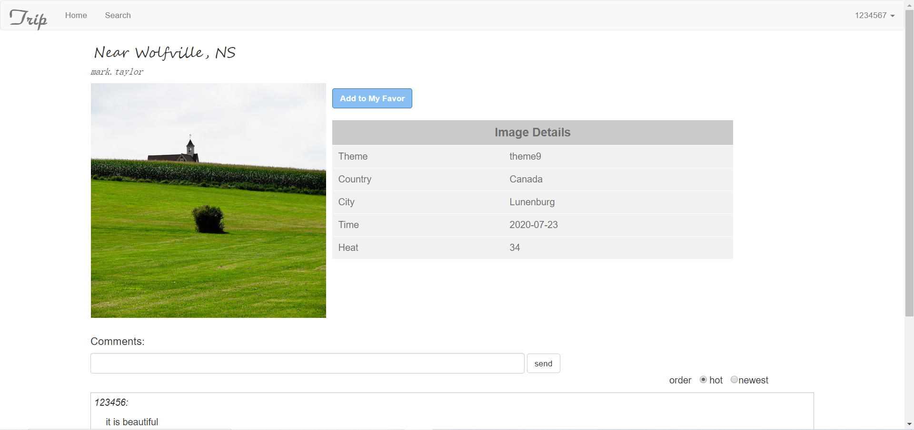
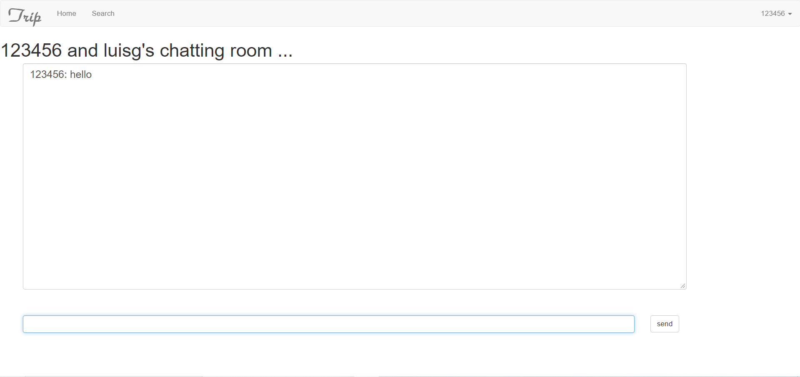

## trip web 项目说明文档

> ###### 颜华 18302010046

### 一、项目概述

​	本项目使用java ee开发平台，sp+servlet、javabean的MVC架构实现了一个旅游图片交流网站。用户可以在网站上分享自己的旅游图片，浏览他人图片、加好友、在线聊天等，并且实现了云端部署。

​	网站http://118.190.55.198:8080/trip/index.jsp

​	GitHub仓库地址：https://github.com/YHsilver/trip-web

### 二、功能说明

##### 1. 注册与登录

用户可点击页面右上角的login/register按钮进入登录注册界面

- 注册：用户需填写用户名（不重复），密码，确认密码，邮箱，验证码信息，注册成功后自动跳转到主页

  

- 登录：用户需输入用户名、密码、验证码

  

##### 2. 查看图片详情

用户可在主页、收藏等界面点击图片链接到图片详情页面，显示图片详细信息，以及用户的评论。对于已登录的用户，可收藏图片到自己的收藏夹下，还可以对图片进行评论。

##### 3. 搜索图片

用户可点击导航栏的search进入搜索图片界面，可根据主题或者标题搜素，并按照上传时间或者热度排序。

##### 4. 收藏列表

用户可查看自己的收藏列表，并可以在该界面移除收藏

##### 5.上传图片

- 用户可以上传新的图片，需输入各种信息并选择上传图片

- 用户可在我的上传界面查看已上传的图片，并且支持修改和删除

  

- 修改已上传的图片信息

  

  

##### 6. 好友功能

- 用户可按照用户名搜索用户并发送好友请求

  

- 用户可选择是否接收好友申请

  

- 界面显示好友列表，且可查看好友收藏，可与好友进行实时聊天

  

- 在该界面可设置你的收藏对好友的可见性

  

- 好友收藏列表，可查看好友的收藏，如果好友设置了可见性，则不可查看

  

  

- 好友实时聊天

  

### 三、项目架构

##### 1. 项目目录结构

- out: 项目部署输出文件

- com.dao: DAO层代码，与javaBean对应的DAO都继承至基类BaseDAO

  

- com.entity：javaBean实体类，与数据相对应；对应MVC架构中的Model

- com.service：后端提供的service，存放的是各种servlet；对应MVC架构中的Control

- com.test：junitTest

- com.utils：工具包，主要是jdbcUtils，存放配置数据库链接公共工具

- web/static：页面静态代码，如js，css，image

- web/WEB-INF/lib：项目所以来的jar包

- web/xxx.jsp:jsp页面代码；对应MVC架构中的View

##### 2. 数据库结构

### 四、关键功能实现

##### 1.	注册登录及验证码

- 基本信息：jsp填写表单信息，js校验表单信息是否满足规范，若满足，提交请求到后台servlet，否则提示用户填写相应信息

- 验证码：js生成随机数，用canvase绘制图片，输出到页面，提交的时候验证是否一致

##### 2.	搜索及分页功能

- 根据用户输入的信息，利用sql的LIKE和ORDER BY 关键字实现搜索
- 对于分页，利用js根据总数目生成分页条，跳转的时候js发送ajax请求，并附带搜索信息及分页条件（当前页数，每页数目等），serklet按条件利用LIMIT 搜索指定数目的信息并返回

##### 3.	图片详情及评论功能

- 每次进入图片详情页面需传入一个imageId（GET方式），servlet根据id查找图片并将相关信息存储在session里，jsp根据session内容输出
- 评论图片：建立一个储存评论信息的数据表，对应一个用户对一张图片的一次评论，评论，点赞，查看等操作都只是对数据的增删改查了
- 图片放大镜 ：设置两个img元素，一个放原始图片（较小），一个放较大的图片，较大的图片默认隐藏且显示范围小于图片大小，当鼠标在较小的图片上时，计算出其对应的在较大图片上的位置，js设置较大图片的边距，并在固定区域显示

##### 4.	上传及修改图片

- 上传图片，get请求不带参数，用户输入基本信息，并上传图片，js验证基本信息，提交到后台，sevlet使用@MultipartConfig，以及Part来接收文件，储存基本信息以及文件path到数据库
- 修改图片：get请求带一个imageId的参数，后端在得到具体信息，返回jsp页面，js设置控件value。对于图片，默认显示原始图片，若用户上传的时候不需要修改图片则上传图片信息为空，后台使用原始图片，若修改了图片则不为空

##### 5.	好友功能

- 添加好友：根据用户名搜索用户，返回前端，js更新html，用户需先添加好友请求，将请求信息存到数据库，被邀请者需要接收好友请求后双方才能成为好友
- 查看好友收藏及好友权限设置：传入用户的id，根据用户的状态（是否允许好友查看），显示好友收藏相关信息
- 好友实时聊天：当一方进入聊天室，创建一个聊天室，双方共享，发送信息时添加内容到该实例的属性上，前端每隔一定时间（1s）向后端发送getMessage的请求，后端返回数据js更新html。若超过一定时间没有信息，则后台回收聊天室。

##### 6.	云端部署

- 首先租一台具有公网ip的云服务器（本次使用的时aliyun的体验卡）
- 在云服务器上配置jdk，tomcat，mysql
- 将项目打包成一个war包，放到tomcat的webapps目录下，启动tomcat，mysql服务为即可
- 项目网址：http://118.190.55.198:8080/trip/index.jsp

### 五、实验总结

​	个人认为本次项目开发难度不算太大，但是个人完成这么多的功能还是显得有些繁琐。这次项目是在之前用过Spring boot框架的情况下，反过来利用原生的jsp+javaBean+servlet的MVC架构来开发web项目。虽然很多现代网站基本上都用成熟的框架，但是我感觉学习了基础的技术之后，对于理解各种框架有很大的帮助，比如之前有用过的Hibernate基本上就是用到了DAO的模式，当时不知道原理，只是照葫画瓢的用，现在大概知道了其是利用反射+JavaBean实体类封装了各种对数据库的操作。这样的一次开发可以帮助我们更容易理解各种相关框架，对于各种异常信息的处理也会更简单些。

